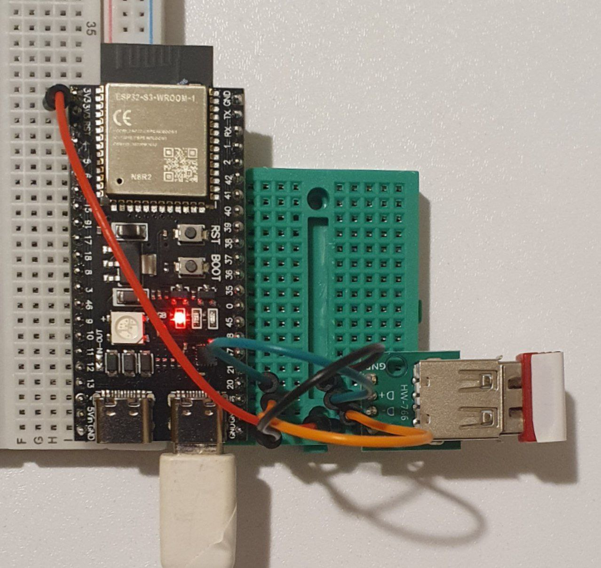

# ESP32 USB Mouse to BLE

This project is based on esp-idf. It is tested on an esp32s3 and an a4tech mouse.

If you use a USB A connector, connect D- to GPIO19 and D+ to GPIO20.

This project is a proof of concept to demonstrate the idea's feasibility. It is not intended for serious real-world deployments.

The use of esp32s3 (in comparison to esp32) is because it supports USB Host. Use esp-idf 5.3 or later to support macOS.

